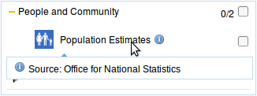

iShare LayerInfo
=================

Allows a simple tooltip to be displayed containing some extra information for a layer in the iShare 5.x layer control.

Installation
------------

Copy all files into `WebApps\Web\custom\layerinfo\`

The css file `layerinfo.css` needs to be included in the head section of your main iShare page:

    <link href="custom/layerinfo/layerinfo.css" type="text/css" rel="stylesheet" />

The JavaScript file `layerinfo.js` needs to be included before the end of the body section in your main iShare page:

    

Configuring Layers
------------------

To configure which layers a tooltip should be shown for open up `layerinfo.js` and edit the section at the top of
the file to include an entry for each layer that should display a tooltip.

The event that triggers the tooltip to be shown can be optionally be configured, see the comments in `layerinfo.js`
for details.

Screenshot
----------

A layer configured with a tooltip taken from [Surrey-i](http://maps.surreyi.gov.uk/mysurreyi.aspx):

